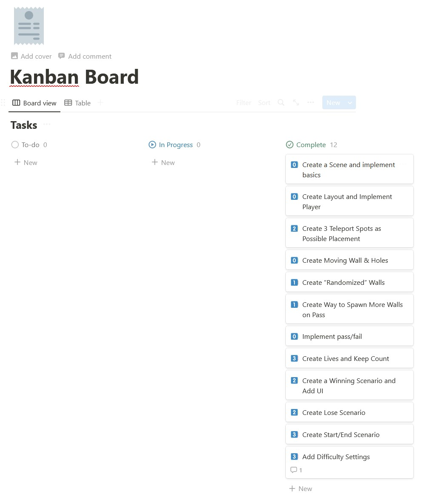

# XR Bootcamp - Prototyping - Week 1
> Hole In The Wall

## Table of Contents

- [About](#about)
- [Todo](#todo)
- [Resources](#resources)

## About

This is my Week 1 portfolio project created for the XR Bootcamp Prototyping course.

Essentially, a wall is moving towards the player where they have to try to
fit through a hole in the wall so they don't get hit.

## Todo

**Current Goal:** Add Comments to Code.

*10/26 12:12PM* Finally figured out how to set up OBS and record the game. It took me a bit to upload it.

## Resources

[Skybox](https://pixexid.com/image/92b7d861-world-trade-center-nyc) - "World Trade
Center nyc" by Pixexid with a Free Image License.

*Unity Packages:*

[ProBuilder](https://unity.com/features/probuilder) - Used by me for all 3D modeling
implemented.

[SteamVR](https://www.steamvr.com/en/) - Click on "For Developers" for what I used to
create this VR experience.